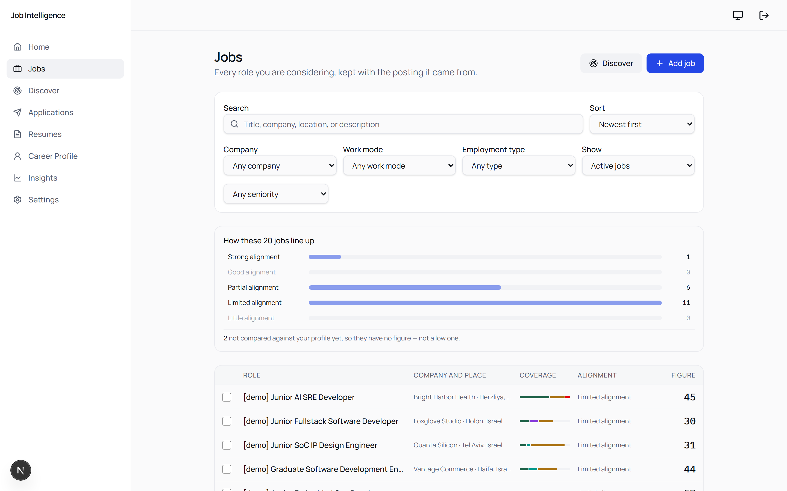
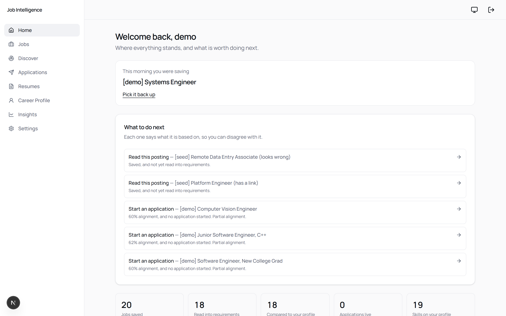
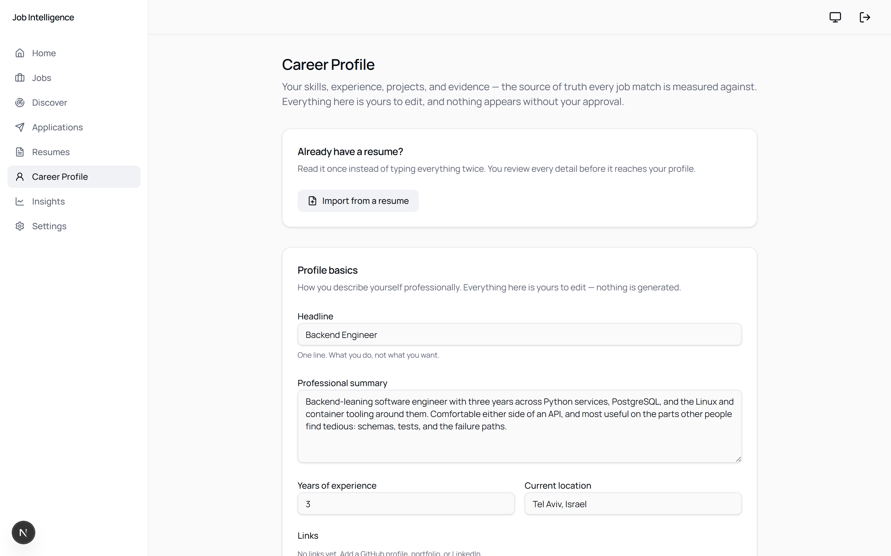
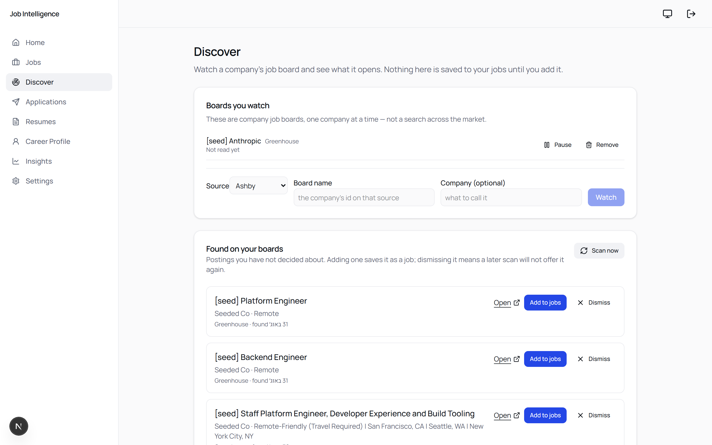
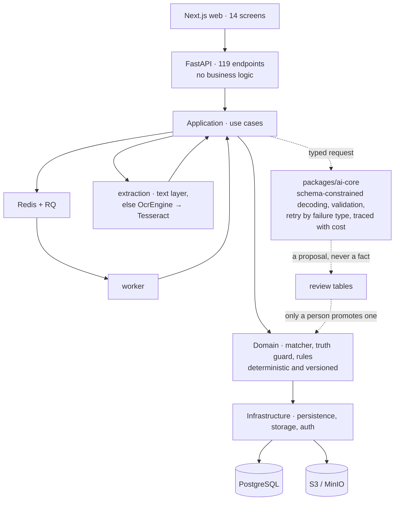

# Job Intelligence Platform

**Reads a job posting into structured requirements, matches it against a
verified career profile with traceable evidence, and writes a tailored résumé
that cannot make a claim your profile does not support.**

Applying for a job means reading a posting, working out honestly whether you
fit it, and rewriting your résumé without overstating yourself. This does those
three things as one system, and refuses to invent anything along the way.

A personal project by one developer, July–September 2026.
**FastAPI · Next.js · PostgreSQL · Redis · Docker**
· 119 REST endpoints · 2,300+ automated tests · 300+ commits

**If you have five minutes:** the [architecture](#architecture) below, then
[`matcher.py`](apps/api/src/jip_api/application/matching/matcher.py) — the
scoring engine, which contains no model call — and
[`packages/ai-core`](packages/ai-core), the one place a model is spoken to.

**If you have fifteen:** add [`docs/adr/`](docs/adr) for the decisions and the
alternatives rejected, [`dev-011-results.md`](docs/development/dev-011-results.md)
for the engine calibrated by hand against real postings, and
[`known-issues.md`](docs/development/known-issues.md) for every defect found and
what was done about it.


*Every requirement, twice: what the posting said, and how the system read it.
The reading is labelled as a reading — and the two are never merged.*

---

## The idea

Most job tools score a résumé against a posting and hand back a number. This one
is built on the assumption that **the number is the least useful part**.

What matters is *why*. Every verdict here is traceable to a specific row of the
user's own career data — this role, that project, this bullet — and anything the
system cannot evidence, it says so about rather than guessing.

Three rules shaped almost every technical decision:

1. **Never fabricate.** A generated résumé line containing a figure that appears
   nowhere in the user's data is blocked, quoted back, and shown for review.
2. **AI never controls verified facts.** Model output lands in a review table and
   stops there. Only a person turns a proposal into a career fact.
3. **Separate what was said from what we concluded.** The posting's own words are
   preserved and quoted; every judgement is labelled as a reading and carries its
   reasoning.

## What it does

```text
Build a profile  →  Save a job  →  Read the posting  →  Match with evidence
                                        →  Tailor a résumé  →  Apply  →  Track
```

- **Career profile** — skills, experience, projects, education, preferences,
  built by hand or imported from a résumé and reviewed proposal by proposal.
- **Document ingestion** — a PDF's text layer where there is one, and OCR where
  there is not, so a scan or a phone photograph is read rather than refused.
  Which path ran is stored and shown, because text recognised from a picture is
  not the same evidence as text lifted from a file.
- **Job intelligence** — a posting parsed into typed requirements with an
  importance the model must not overstate, plus role family and seniority.
- **Matching** — requirement-level verdicts, each linked to the evidence behind
  it, with a recommendation stored separately from the score so the two can
  disagree.
- **Résumé tailoring** — strategy, then suggestions, then truth validation, then
  a review, then a version. Five stages, five requests, never one call rewriting
  a document.
- **Applications and insights** — an append-only application history, and what
  the user's own saved jobs keep asking for.

## What it looks like

Captured from a demo account by
[`scripts/capture_screenshots.mjs`](scripts/capture_screenshots.mjs), so these
can be re-taken rather than going quietly stale. The postings behind them were
real; every employer name was replaced and the posting prose dropped, which is
why rows read `[demo]`.

### Every role you are considering



The bands come from the engine. Two of these jobs sit outside them — not
compared yet, so they have no figure rather than a low one, which is a
distinction most tools quietly lose.

### What to do next, and why



Every suggestion carries what it was based on. A recommendation you can
disagree with is one that told you why.

### The profile every verdict traces back to



Skills, experience, education and the evidence behind each. Nothing arrives
here without a person approving it, including anything a model proposed.

### Postings found rather than pasted



Public job boards, scanned into a review list. A scan finds candidates; only a
person turns one into a job.

## Architecture

A modular monolith, layered so that the rules can be tested without a database
and the model can be swapped without touching them.



**The dotted path is the point.** Model output enters through one boundary,
arrives schema-validated, and stops in a review table. None of it reaches the
scoring engine.

OCR sits behind the same kind of seam
([ADR-0008](docs/adr/0008-ocr-behind-an-engine-interface.md)): an `OcrEngine`
protocol takes page bitmaps and returns text, and the pipeline does not know
which engine it has. Tesseract is the first implementation, not the design.

That the domain never imports `ai-core` is
[a test](apps/api/tests/unit/test_domain_does_not_reach_a_provider.py), not a
convention — written after this file claimed the boundary was enforced and a
check found that nothing was enforcing it.

## The parts worth reading

If you are evaluating this as engineering work rather than as a product, these
are the files where the thinking is:

| | |
|---|---|
| [`matching/matcher.py`](apps/api/src/jip_api/application/matching/matcher.py) | The scoring engine, at 6.0.0. **Deterministic and versioned — no model call anywhere in it**, and eight verdicts rather than a percentage |
| [`dev-011-results.md`](docs/development/dev-011-results.md) | Nine real postings, scored by the engine and by a person, and what came out of every disagreement |
| [`resumes/truth.py`](apps/api/src/jip_api/application/resumes/truth.py) | The fabrication guard. Refuses invented figures, flags introduced terminology, classifies risk |
| [`packages/ai-core`](packages/ai-core) | The provider boundary: schema-constrained decoding, validation on the way back, retry by failure type, a trace per attempt with cost |
| [`tests/accuracy/test_ocr_accuracy.py`](apps/api/tests/accuracy/test_ocr_accuracy.py) | OCR measured rather than asserted — character and word error rates against generated ground truth, and the finding that retired a shipped number |
| [`docs/adr/`](docs/adr) | Eight architecture decisions, each with the alternative that was rejected |
| [`known-issues.md`](docs/development/known-issues.md) | Every defect found, its cause, the fix, and the test that now covers it |

Two details from the matcher worth the click. `NO_EVIDENCE` is **excluded from
the average rather than scored zero** — an incomplete profile must not quietly
lower the number. And the nine calibration postings moved the engine five major
versions without changing a single weight, cap or threshold: every one was a
defect in the code rather than a rule that turned out to be wrong.

## Engineering

**Tests.** 2,300+ across three layers:

| | |
|---|---|
| Backend unit + offline AI evaluations | 1,118 |
| Integration, against real PostgreSQL and Redis | 615 |
| Frontend | 573 |

Plus a live-model evaluation suite that runs on request, because it costs
money, and an OCR accuracy suite that needs the Tesseract binary and skips with
a reason where it is absent.

**Checks**, as a GitHub Actions workflow on every pull request, and as
`python scripts/run_checks.py` locally — the same set in the same order, so a
failure is found before the push rather than after it: `mypy --strict` over 327
files, TypeScript `strict` with `noUncheckedIndexedAccess`, ruff, eslint,
prettier, an Alembic `upgrade head → downgrade base` round-trip, and a Docker
Compose stack brought up from scratch.

**Scale.** ~108,000 lines of code across the API, the web app, the worker, the
shared packages, the tests and the tooling, and ~25,000 more of documentation —
every tracked file except the lockfile and the images, counted with `wc -l`, so
the figure can be reproduced rather than taken. Reported as a fact about the
surface, not as a claim about its quality.

**AI is treated as an untrusted input**, not as a library call. Every operation
has a typed output schema, schema validation, a versioned prompt, a persisted
run trace, and an evaluation fixture. Failures are classified: a permanent one
is never retried, and a retry is never offered where it cannot work.

**Measured, and it changed the answer.** The OCR path shipped a line on the
review screen reading *"82% clear"*, taken from the engine's mean word
confidence. Building the accuracy suite showed the figure does not mean that:

| condition | character error rate | mean confidence | words emitted |
|---|---|---|---|
| skew 2.5°, blur 3.5 | 0.45 | 86.9 | 25 of 40 |
| skew 3.5°, blur 4.5 | 0.20 | 53.4 | 40 of 40 |

**The worse read reported the higher confidence.** A mean averages the words
the engine emitted, and a badly confused engine abandons the hard ones — an
abandoned word lands in the error rate as a deletion and nowhere in the mean.
The figure measured the words kept, not the words lost. No statistic over that
output can see the loss, so the number was removed rather than replaced.

Two more things the measurement produced. Accuracy does not degrade with
resolution, it falls off a cliff — flawless from 300 DPI down to 100, then 0.54
at 50 and nothing at 40. And the first version of the accuracy test measured
nothing at all: it compared 300 DPI against 120, both scored perfectly, and it
failed as `0.0 > 0.0`.

**Verification automated tests cannot do** is written down rather than assumed:
[`manual-verification-checklist.md`](docs/development/manual-verification-checklist.md)
records what a person walked, when, and what it found — 95 checks so far.

One sitting is why the file exists. Twelve stages walked, eleven turned up a
defect the suite had missed, nearly every one a screen saying the wrong thing
about a calculation that was right. No unit or integration test sees that class
of fault. A browser does, which is also why
[`tests/e2e`](tests/e2e) exists.

## Running it

```bash
cp .env.example .env
docker compose up --build
```

Web on `:3000`, API on `:8000`, API docs on `:8000/docs`.

**Sign-in without registering anywhere.** Authentication is OIDC and normally
goes to Clerk, which means an account before the first screen renders. Set both
halves to skip that:

```bash
JIP_AUTH_PROVIDER=local          # and NEXT_PUBLIC_AUTH_PROVIDER=local for the web
JIP_AUTH_LOCAL_SECRET=…          # and AUTH_LOCAL_SECRET, the same value
```

`/sign-in` then asks for a name instead of credentials, and the name becomes the
profile. It verifies a real signature against a real expiry — only the key
source changes. **The API refuses to build that verifier outside `local` and
`test`**, so a demo convenience cannot reach a deployment.
`python scripts/seed_dev_data.py` fills the account with enough to look at.

The AI features need an API key in `.env`; everything else runs without one. For
host-process development, the checks, and the Windows notes, see
[`local-environment.md`](docs/development/local-environment.md).

## Status

**The whole chain works end to end**, on a real profile against real postings:
build a profile, save a posting, read it into requirements, match it with
evidence, tailor a résumé against the match, and track what happened. Fourteen
screens, and every capability listed above is built rather than planned.

**What is deliberately not claimed.** It is not deployed and it has one user.
It was built to be correct rather than to scale: no load testing, and no
evidence about how it behaves with a thousand accounts, because none of that
has been measured.

[`implementation-status.md`](docs/development/implementation-status.md) says
what exists and where it is thinner than it looks.

## How it was built

Written with AI coding assistance, and worth saying plainly rather than leaving
to be discovered.

**The specifications came first**, which is checkable rather than asserted: the
first commit in this repository is twelve specification documents, and the
first domain model arrives three hours later. The architecture, the domain
rules and the acceptance criteria were decided before anything implemented
them, and the judgement calls are the documented ones —
[`docs/adr/`](docs/adr) for what was rejected and why,
[`dev-011-results.md`](docs/development/dev-011-results.md) for an engine
disagreed with by hand nine times.

The tests are what makes working this way safe. An assistant that produces a
plausible wrong answer quickly moves the bottleneck from typing to
verification, which is why the boundary test above exists and why the claims on
this page were checked before they were written.

## Documentation

Twelve specification documents, seven architecture decisions, and the
development tracking — indexed in [`docs/`](docs).

Working in this repository with an AI agent? [`AGENTS.md`](AGENTS.md) is the entry point:
what to read, how to verify, and the four things that will catch you out.
