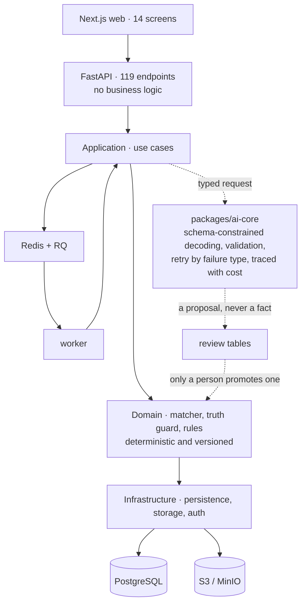

# Job Intelligence Platform

**Reads a job posting into structured requirements, matches it against a
verified career profile with traceable evidence, and writes a tailored résumé
that cannot make a claim your profile does not support.**

Applying for a job means reading a posting, working out honestly whether you
fit it, and rewriting your résumé without overstating yourself. This does those
three things as one system, and refuses to invent anything along the way.

A personal project by one developer, July–August 2026.
**FastAPI · Next.js · PostgreSQL · Redis · Docker**
· 119 REST endpoints · 2,233 automated tests · 294 commits

**If you have five minutes:** the [architecture](#architecture) below, then
[`matcher.py`](apps/api/src/jip_api/application/matching/matcher.py) — the
scoring engine, which contains no model call — and
[`packages/ai-core`](packages/ai-core), the one place a model is spoken to.

**If you have fifteen:** add [`docs/adr/`](docs/adr) for the decisions and the
alternatives rejected, [`dev-011-results.md`](docs/development/dev-011-results.md)
for the engine calibrated by hand against real postings, and
[`known-issues.md`](docs/development/known-issues.md) for every defect found and
what was done about it.


*Every requirement, twice: what the posting said, and how the system read it.
The reading is labelled as a reading — and the two are never merged.*

---

## The idea

Most job tools score a résumé against a posting and hand back a number. This one
is built on the assumption that **the number is the least useful part**.

What matters is *why*. Every verdict here is traceable to a specific row of the
user's own career data — this role, that project, this bullet — and anything the
system cannot evidence, it says so about rather than guessing.

Three rules shaped almost every technical decision:

1. **Never fabricate.** A generated résumé line containing a figure that appears
   nowhere in the user's data is blocked, quoted back, and shown for review.
2. **AI never controls verified facts.** Model output lands in a review table and
   stops there. Only a person turns a proposal into a career fact.
3. **Separate what was said from what we concluded.** The posting's own words are
   preserved and quoted; every judgement is labelled as a reading and carries its
   reasoning.

## What it does

```text
Build a profile  →  Save a job  →  Read the posting  →  Match with evidence
                                        →  Tailor a résumé  →  Apply  →  Track
```

- **Career profile** — skills, experience, projects, education, preferences,
  built by hand or imported from a résumé PDF and reviewed proposal by proposal.
- **Job intelligence** — a posting parsed into typed requirements with an
  importance the model must not overstate, plus role family and seniority.
- **Matching** — requirement-level verdicts, each linked to the evidence behind
  it, with a recommendation stored separately from the score so the two can
  disagree.
- **Résumé tailoring** — strategy, then suggestions, then truth validation, then
  a review, then a version. Five stages, five requests, never one call rewriting
  a document.
- **Applications and insights** — an append-only application history, and what
  the user's own saved jobs keep asking for.

## What it looks like

Captured from a demo account by
[`scripts/capture_screenshots.mjs`](scripts/capture_screenshots.mjs), so these
can be re-taken rather than going quietly stale. The postings behind them were
real; every employer name was replaced and the posting prose dropped, which is
why rows read `[demo]`.

### Every role you are considering


The bands come from the engine. Two of these jobs sit outside them — not
compared yet, so they have no figure rather than a low one, which is a
distinction most tools quietly lose.

### What to do next, and why


Every suggestion carries what it was based on. A recommendation you can
disagree with is one that told you why.

### The profile every verdict traces back to


Skills, experience, education and the evidence behind each. Nothing arrives
here without a person approving it, including anything a model proposed.

### Postings found rather than pasted


Public job boards, scanned into a review list. A scan finds candidates; only a
person turns one into a job.

## Architecture

A modular monolith, layered so that the rules can be tested without a database
and the model can be swapped without touching them.



**The dotted path is the point.** Model output enters through one boundary,
arrives validated against a schema, and stops in a review table. Nothing on it
reaches the scoring engine: `matcher.py` takes a profile snapshot and a list of
requirements, and returns the same verdicts every time.

`apps/` holds `web`, `api` and `worker`; `packages/` holds `ai-core`,
`shared-types`, `prompts` and `config`.

That the domain never imports `ai-core` is
[a test](apps/api/tests/unit/test_domain_does_not_reach_a_provider.py), not a
convention. It was written after this README claimed the boundary was enforced
and a check found that nothing was enforcing it — it had simply been true so
far, which is a different thing.

## The parts worth reading

If you are evaluating this as engineering work rather than as a product, these
are the files where the thinking is:

| | |
|---|---|
| [`application/matching/matcher.py`](apps/api/src/jip_api/application/matching/matcher.py) | The scoring engine. **Deterministic and versioned — no model call anywhere in it.** Eight verdicts, including `NO_EVIDENCE`, which is excluded from the average rather than scored zero: an incomplete profile must not quietly lower the number. At **6.0.0**: nine real postings were read against it and moved it five majors, every one a defect rather than a rule change |
| [`dev-011-results.md`](docs/development/dev-011-results.md) | Those nine postings, scored by the engine and by a person, and what came out of every disagreement |
| [`application/resumes/truth.py`](apps/api/src/jip_api/application/resumes/truth.py) | The fabrication guard. Refuses invented figures, flags introduced terminology, and classifies risk |
| [`packages/ai-core`](packages/ai-core) | The provider boundary: JSON-schema constrained decoding, schema validation, retry classified by failure type, and a trace per attempt with token cost |
| [`docs/adr/`](docs/adr) | Seven architecture decisions, each with the alternative that was rejected and why |
| [`docs/development/known-issues.md`](docs/development/known-issues.md) | Every defect found, what caused it, and what was done. Including the ones that were embarrassing |

## Engineering

**Tests.** 2,200+ across three layers:

| | |
|---|---|
| Backend unit + offline AI evaluations | 1,047 |
| Integration, against real PostgreSQL and Redis | 615 |
| Frontend | 571 |

Plus a live-model evaluation suite that runs on request, because it costs money.

**Checks**, as a GitHub Actions workflow on every pull request, and as
`python scripts/run_checks.py` locally — the same set in the same order, so a
failure is found before the push rather than after it: `mypy --strict` over 315
files, TypeScript `strict` with `noUncheckedIndexedAccess`, ruff, eslint,
prettier, an Alembic `upgrade head → downgrade base` round-trip, and a Docker
Compose stack brought up from scratch.

**Scale.** ~89,000 lines across the API, the web app, the worker, the shared
packages, the tests and the tooling — reported as a fact about the surface, not
as a claim about its quality.

**AI is treated as an untrusted input**, not as a library call. Every operation
has a typed output schema, schema validation, a versioned prompt, a persisted
run trace, and an evaluation fixture. Failures are classified: a permanent one
is never retried, and a retry is never offered where it cannot work.

**Verification that automated tests cannot do** is written down rather than
assumed. [`manual-verification-checklist.md`](docs/development/manual-verification-checklist.md)
records what a person walked, on what date, and what it found: 95 checks so far.

One run of it is the reason the file exists. Twelve stages were walked in a
sitting and eleven turned up a defect the suite had missed — nearly every one a
screen saying the wrong thing about a calculation that was correct. No unit or
integration test can see that class of fault. A browser can, which is also why
[`tests/e2e`](tests/e2e) exists.

## Running it

```bash
cp .env.example .env
docker compose up --build
```

Web on `:3000`, API on `:8000`, API docs on `:8000/docs`.

**Sign-in without registering anywhere.** Authentication is OIDC and normally
goes to Clerk, which means an account before the first screen renders. Set both
halves to skip that:

```bash
JIP_AUTH_PROVIDER=local          # and NEXT_PUBLIC_AUTH_PROVIDER=local for the web
JIP_AUTH_LOCAL_SECRET=…          # and AUTH_LOCAL_SECRET, the same value
```

`/sign-in` then asks for a name instead of credentials, and the name becomes the
profile. It verifies a real signature against a real expiry — only the key
source changes. **The API refuses to build that verifier outside `local` and
`test`**, so a demo convenience cannot reach a deployment.
`python scripts/seed_dev_data.py` fills the account with enough to look at.

The AI features need an API key in `.env`; everything else runs without one. For
host-process development, the checks, and the Windows notes, see
[`local-environment.md`](docs/development/local-environment.md).

## Status

**The whole chain works end to end**, on a real profile against real postings:
build a profile, save a posting, read it into requirements, match it with
evidence, tailor a résumé against the match, and track what happened. Fourteen
screens, and every capability listed above is built rather than planned.

**What is deliberately not claimed.** It is not deployed, and it has one user.
It was built to be correct rather than to scale: there is no load testing, no
multi-region anything, and no evidence about how it behaves with a thousand
accounts, because none of that has been measured.

The two documents that say what is actually true are
[`implementation-status.md`](docs/development/implementation-status.md) — what
exists, and where it is thinner than it looks — and
[`known-issues.md`](docs/development/known-issues.md) — every defect found, its
cause, the fix, and the test that now covers it.

## How it was built

Written with AI coding assistance, and worth saying plainly rather than leaving
to be discovered.

What that did **not** cover is the part this repository is mostly made of: the
specifications came first and the architecture, the domain rules, the
acceptance criteria and the verification were decided and written down before
anything implemented them. The judgement calls are the documented ones —
[`docs/adr/`](docs/adr) records what was rejected and why,
[`dev-011-results.md`](docs/development/dev-011-results.md) is an engine
disagreed with by hand nine times, and
[`manual-verification-checklist.md`](docs/development/manual-verification-checklist.md)
is what a person walked and what it found.

The tests are the load-bearing part of working this way. An assistant that can
produce a plausible wrong answer quickly makes verification the bottleneck, not
typing — which is why the boundary test above exists, and why a claim in this
file gets checked before it gets written.

## Documentation

Twelve specification documents were written **before** the code and maintained
alongside it, plus seven architecture decisions and the development tracking.
Indexed in [`docs/`](docs).

Building on this with an AI agent? [`AGENTS.md`](AGENTS.md) is the entry point:
what to read, how to verify, and the four things that will catch you out.
