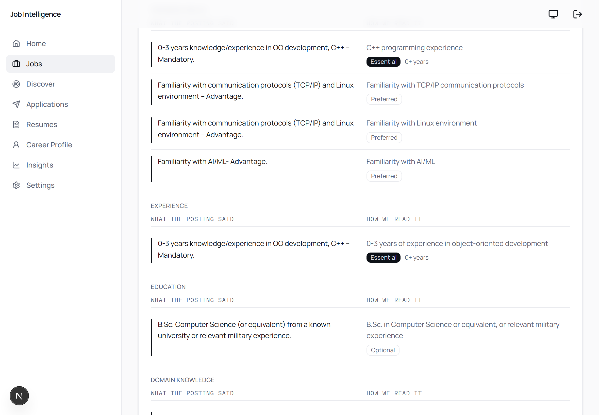
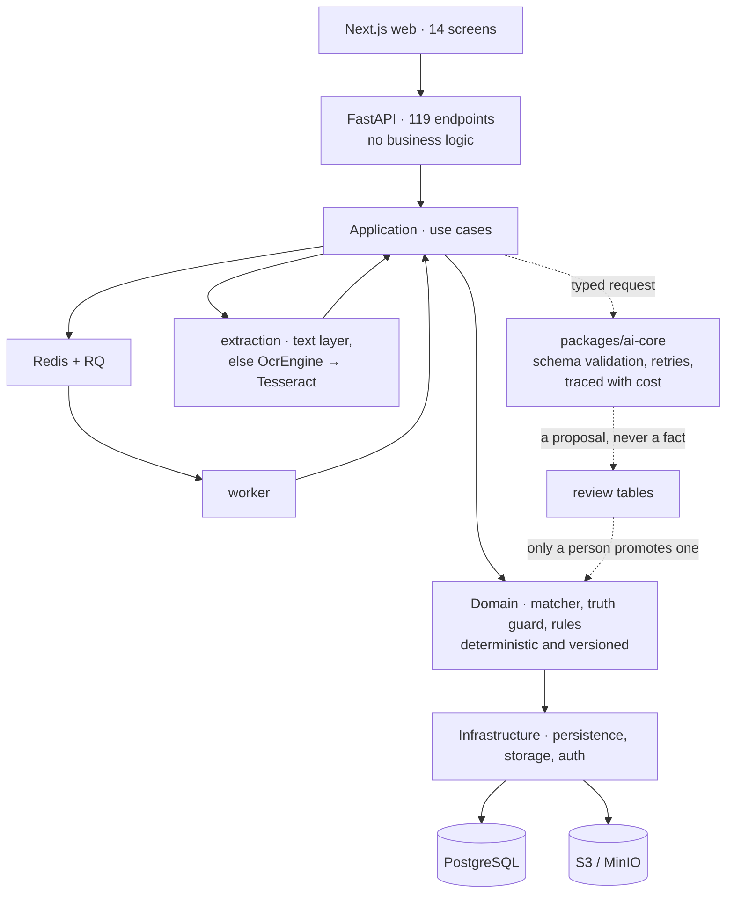

# Job Intelligence Platform

A job-search platform that reads a job posting, compares it with your career
profile — showing the evidence behind every verdict — and helps you tailor your
résumé without ever claiming something your profile doesn't support.

**Python · FastAPI · Next.js · TypeScript · PostgreSQL · Redis · Docker**
A personal project, built July–September 2026.



*Each requirement from the posting, how the system read it, and the verdict with
the evidence behind it.*

**Short on time?** Look at the [architecture](#architecture) and at
[`matcher.py`](apps/api/src/jip_api/application/matching/matcher.py), the
scoring engine.

## What it does

```text
Build a profile → Save a job → Analyse the posting → Match with evidence → Tailor a résumé → Track applications
```

- **Career profile** — skills, experience, projects and education, entered by
  hand or imported from a résumé and reviewed item by item.
- **Résumé import** — reads PDF and Word files, including scanned PDFs through
  OCR.
- **Job analysis** — turns a posting into typed requirements (skills,
  experience, education, and so on), each with its importance.
- **Matching** — a verdict for every requirement, linked to the part of your
  profile that supports it.
- **Résumé tailoring** — suggests changes for a specific job, and checks every
  suggestion against your profile before you see it.
- **Job discovery** — scans public job boards (Greenhouse, Ashby, Lever) into a
  review list.
- **Tracking and insights** — your application history, and which skills your
  saved jobs ask for most.

## Design principles

1. **Never invent facts.** A suggested résumé line containing a figure that
   isn't in your profile is blocked; new terminology is flagged for review.
2. **AI suggests, a person decides.** Model output goes into a review queue.
   Nothing becomes part of your profile until you approve it.
3. **Evidence over scores.** Every verdict points to the role, project or skill
   it's based on. When there is no evidence, the system says so instead of
   guessing.

## Screenshots

| | |
|---|---|
| <br>**Saved jobs** — grouped by how well they fit, with requirement coverage for each. | <br>**Home** — suggested next steps, each with the reason behind it. |
| <br>**Career profile** — the data every verdict traces back to. | <br>**Discovery** — postings found on public job boards, waiting for review. |

Taken from a demo account: employer names are replaced and rows are marked
`[demo]`.

## Architecture

A modular monolith with clear layers, so the business rules can be tested
without a database and the AI provider can be swapped without touching them.



The scoring engine never calls a model. AI output enters through a single
package, [`packages/ai-core`](packages/ai-core), is validated against a schema,
and stops in a review table. A
[test](apps/api/tests/unit/test_domain_does_not_reach_a_provider.py) enforces
that the domain layer never imports it.

## Engineering highlights

- **A deterministic, versioned matching engine** —
  [`matcher.py`](apps/api/src/jip_api/application/matching/matcher.py). No model
  calls, and every match keeps the engine version that produced it. Missing
  evidence is left out of the average rather than scored as zero, so an
  incomplete profile doesn't quietly lower the result.
- **A fabrication guard** —
  [`truth.py`](apps/api/src/jip_api/application/resumes/truth.py) checks each
  suggested résumé line against your data before you see it.
- **AI treated as an untrusted input** — every model call has a typed schema,
  validation on the way back, a versioned prompt, retries that depend on the
  kind of failure, and a stored trace with its cost.
- **OCR, measured rather than assumed** — scanned résumés are read with
  Tesseract behind an interface
  ([ADR-0008](docs/adr/0008-ocr-behind-an-engine-interface.md)). Measuring
  accuracy showed something unexpected: the engine's confidence went *up* as
  the reading got *worse*, because a confused engine drops the hard words and
  they never count against it. The percentage was removed from the UI.

  | condition | error rate | confidence |
  |---|---|---|
  | skew 2.5°, blur 3.5 | 0.45 | 86.9 |
  | skew 3.5°, blur 4.5 | 0.20 | 53.4 |

- **Tested at every layer** — 2,300+ automated tests: backend unit tests,
  integration tests against real PostgreSQL and Redis, and frontend tests, plus
  Playwright end-to-end tests in a real browser. CI runs `mypy --strict`, strict
  TypeScript, linting, a database migration round-trip, and a full Docker
  Compose start-up.

## Running it locally

```bash
cp .env.example .env
docker compose up --build
```

Web on `localhost:3000`, API on `:8000`, API docs on `:8000/docs`.

To sign in without creating an account, set `JIP_AUTH_PROVIDER=local` (and
`NEXT_PUBLIC_AUTH_PROVIDER=local` for the web) with the same secret in
`JIP_AUTH_LOCAL_SECRET` and `AUTH_LOCAL_SECRET`. The API refuses this mode
outside local development and tests. `python scripts/seed_dev_data.py` fills
the account with sample data.

The AI features need an API key in `.env`; everything else works without one.
Running without Docker, running the checks, and Windows notes are in
[`local-environment.md`](docs/development/local-environment.md).

## Status

The full flow works end to end on real job postings, across 14 screens and 119
API endpoints. It's a personal project: it isn't deployed, it has one user, and
it hasn't been load-tested.

## How it was built

Built with AI coding assistance — worth saying up front.

The project started from specifications: the first commit is 13 specification
documents, and the first domain code came under three hours later.
Architecture decisions, and the alternatives that were rejected, are recorded
in [`docs/adr/`](docs/adr). The tests are what make working this way safe: an
assistant can produce a plausible wrong answer quickly, so most of the effort
goes into verifying rather than typing.

## Documentation

- [`docs/`](docs) — 13 specification documents: product vision, requirements,
  user flows, domain model, architecture, AI and matching, API contracts,
  engineering standards.
- [`docs/adr/`](docs/adr) — 8 architecture decision records.

## License

Source-available — see [LICENSE](LICENSE).
